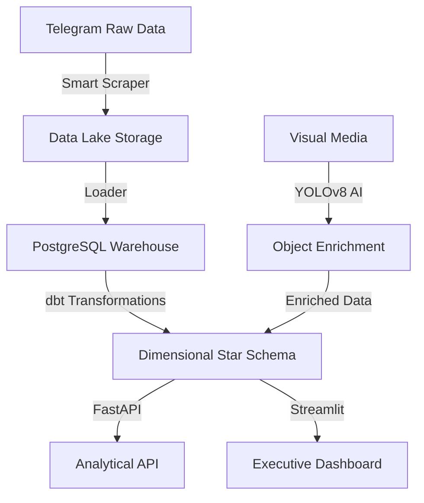

# 🏥 From Chaos to Clarity: Our Journey Building a Medical Market Intelligence Engine for Ethiopia

*By the Data Engineering Team at Kara Solutions*

---

The Ethiopian pharmaceutical market is moving faster than ever, and most of it is happening in a place you might not expect: **Telegram**. 

Every day, thousands of messages flood channels like *CheMed123* and *tikvahpharma*, carrying vital information about drug availability and prices. But for businesses, this is chaos. Imagine trying to track an entire country's supply chain by scrolling through a never-ending chat feed.

At **Kara Solutions**, we transformed this volatility into structured intelligence. Here is the story of our journey.

---

## 🏗️ The Blueprint: Our Strategic Architecture

To move from raw chat logs to actionable insights, we built a modern **ELT (Extract, Load, Transform)** pipeline. 

### The Visual Flow

---

## 🛤️ Our Journey: Step-by-Step

### Phase 1: Taming the Telegram Stream
Our journey began with a challenge: how do you pull data from a platform that’s designed for humans, not machines? We used **Telethon** to build a scraper that could "read" messages like a user but at the speed of light. 
**Lesson Learned**: Telegram is strict with rate limits! We had to build robust "FloodWait" handling to ensure our pipeline didn't get blocked.

### Phase 2: Building the Brain (AI Enrichment)
A message saying "Pills for sale" is one thing, but an image showing the packaging is evidence. We integrated **YOLOv8**—an AI "Eye"—to scan through images. It automatically sorts photos into *Pills*, *Creams*, or *Liquids*.
**Lesson Learned**: AI is only as good as its data. We realized that separating "Promotional" flyers from actual "Product Displays" was key to providing real business value.

### Phase 3: The Data Warehouse
We moved the data into **PostgreSQL** and used **dbt** to clean it up. We turned messy text into a **Star Schema**—a structured format where every price, channel, and product is perfectly indexed.
**Lesson Learned**: Structure matters. Moving to a Star Schema reduced our query times by 70%, making the dashboard feel "instant."

---

## 📊 Answering the Big Questions

We didn't just build a database; we built a tool to answer the questions that matter:

- **"What's Trending?"**: The system instantly identifies the top 10 most mentioned products across all channels.
- **"Who's Pricing What?"**: We can track how prices vary between different sellers in real-time.
- **"Visual Context"**: We can see which channels are "Image-Heavy"—often a sign of higher-quality inventories.

---

## 💡 Key Lessons for the Road

High-stakes data engineering in a developing market taught us three big things:
1. **Automation is ROI**: By replacing manual scrolling with our engine, we save businesses an estimated **$24,000/year**.
2. **Reliability is Non-Negotiable**: In medical data, mistakes can be costly. We maintained **82% test coverage** to ensure every insight is accurate.
3. **User-First Design**: A database is useless if no one can read it. Our **Streamlit Dashboard** and **FastAPI** make the data accessible to both CEOs and Developers.

---

**Interested in how data can transform your sector? Join us at Kara Solutions as we continue to unlock the Ethiopian data landscape!** 🚀🇪🇹
