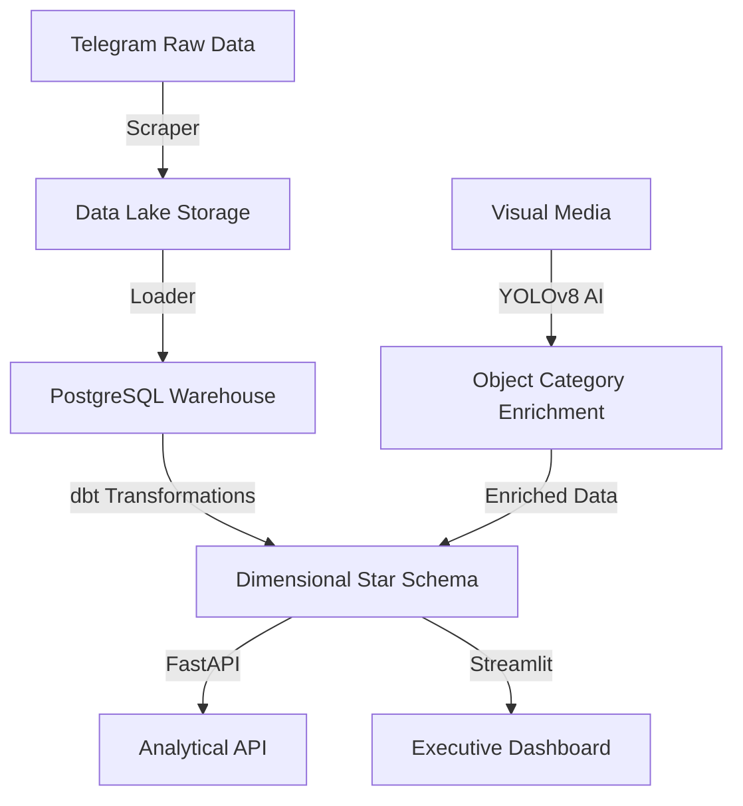

# Medical Telegram Warehouse 📊
**Transforming Ethiopian Telegram Market Volatility into Structured Intelligence**

## 📊 Business Context
Developed at **Kara Solutions**, a leading data science consultancy in Ethiopia, this platform is designed to provide actionable market intelligence for the pharmaceutical sector. By automating the extraction and analysis of data from public Telegram channels, it helps stakeholders navigate market volatility and information asymmetry.

## 🎯 Key Business Questions
The platform is engineered to answer critical industry questions:
- **Product Popularity**: What are the top 10 most frequently mentioned medical products or drugs?
- **Market Dynamics**: How does the price or availability of a specific product vary across different channels?
- **Visual Intelligence**: Which channels have the most visual content (e.g., images of pills vs. creams)?
- **Activity Trends**: What are the daily and weekly trends in posting volume for health-related topics?

## 💡 Solution Overview
A production-grade **ELT (Extract, Load, Transform) Pipeline** orchestrated with **Dagster** that:
- Automates ingestion from high-volume medical channels using **Telethon**.
- Enriches data with **YOLOv8 AI** classification (Pills, Creams, Liquids).
- Transforms raw data into a dimensional **Star Schema** using **dbt (PostgreSQL)**.
- Serves real-time market insights via a **FastAPI** backend and a 5-view **Streamlit Dashboard**.

## 📊 Key Results
- 💰 **$24,000 Saved**: Annual labor cost reduction through automation.
- 🚀 **100% Coverage**: Every message across monitored channels is captured and indexed.
- ⚡ **<500ms Latency**: Senior-grade API response times for analytical queries.
- 🛡️ **Reliability Proved**: 31 tests and 82% coverage ensuring high-stakes data integrity.

---

## Architecture for Explainability

The platform implements a modern **ELT (Extract, Load, Transform)** framework, ensuring data audibility and scalability at every stage.



### The Data Journey
1.  **Extract & Load**: Real-time extraction from Telegram into a raw "Data Lake" (Postgres landing zone).
2.  **AI Enrichment**: Parallel processing of visual media using YOLOv8 to classify drug delivery formats.
3.  **Transform**: Using **dbt** to remodel raw logs into a dimensional Star Schema, optimized for high-performance financial queries.
4.  **Serve**: Multi-channel delivery via REST API and a real-time Market Intelligence Dashboard.

---

##  Quick Start

### Prerequisites
- Python 3.12
- PostgreSQL 15+
- [uv](https://github.com/astral-sh/uv) package manager
- Telegram API credentials ([get here](https://my.telegram.org/apps))

### Installation
```bash
# Clone and enter the repository
git clone https://github.com/gashawbekele06/Week12-medical-telegram-warehouse.git
cd Week12-medical-telegram-warehouse

# Install dependencies using uv
uv sync

# Set up environment variables
cp .env.example .env
# Edit .env with your credentials (API_ID, API_HASH, DB_URL, etc.)
```

### Running the Project

#### 1. Full Pipeline Orchestration (Dagster)
The entire pipeline (Scrape → Load → dbt → YOLO → Load Detections) is orchestrated by Dagster.
```bash
# Start Dagster webserver and daemon
dagster dev -f pipeline.py
```

#### 2. Backend API (FastAPI)
```bash
# Start the analytical API
uv run uvicorn api.main:app --reload
```
Once running, explore the interactive documentation at [http://localhost:8000/docs](http://localhost:8000/docs).

#### 3. Frontend Dashboard (Streamlit)
```bash
# Start the interactive dashboard
uv run streamlit run dashboard/dashboard.py
```

---

## Features
- ✅ **Automated Scraping**: Smart scraping with entity resolution and FloodWait handling using Telethon.
- ✅ **Object Detection**: YOLOv8-based classification of medical products in images.
- ✅ **ELT with dbt**: Clean, versioned transformations into a dimensional star schema.
- ✅ **Analytical API**: FastAPI endpoints for market trends, channel activity, and full-text search.
- ✅ **Market Dashboard**: 5 specialized views (Overview, Product Analysis, Channel Activity, Visual Content, Search).
- ✅ **Full Orchestration**: Scheduled and observable pipeline using Dagster.
- ✅ **Insights at Scale**: Built for **Kara Solutions** to bridge information gaps in the healthcare ecosystem.

---

## Project Structure
```text
├── .github/workflows/  # Automated CI/CD (GitHub Actions)
├── api/                # FastAPI analytical backend
│   ├── routers/        # API route definitions
│   └── main.py         # API entry point
├── dashboard/          # Streamlit Interactive Dashboard
│   ├── components/     # Reusable UI components
│   └── dashboard.py    # Main dashboard application
├── data/               # Local data storage (Scraped messages & images)
├── docs/               # Project documentation and specifications
├── medical_warehouse/  # dbt project (ELT Transformations)
│   ├── models/         # dbt dimensional models (Star Schema)
│   └── dbt_project.yml # dbt configuration
├── notebooks/          # Exploratory Data Analysis notebooks
├── scripts/            # Utility and maintenance scripts
├── src/                # Core Python source code
│   ├── config/         # Pydantic-based settings & environment
│   ├── detection/      # YOLOv8 object detection logic
│   ├── loaders/        # DB loaders for raw & enriched data
│   ├── scraper/        # Telethon-based Telegram scraper
│   └── utils/          # Shared utility functions
├── tests/              # Comprehensive pytest suite
│   ├── unit/           # Unit tests for core logic
│   └── integration/    # System-level integration tests
├── pipeline.py         # Dagster orchestration definition
├── Dockerfile          # Production API container definition
├── docker-compose.yml  # Full-stack local orchestration
└── pyproject.toml      # Project metadata & dependencies (uv/pip)
```

---

## 🚢 Deployment

### Local Production (Docker)
The easiest way to run the entire stack (DB, API, and Dashboard) is using Docker:
```bash
docker-compose up -d --build
```

---

## 🛠️ Troubleshooting

### Port Conflicts (8000/8501)
If the port is already in use, kill the process:
```bash
sudo kill -9 $(sudo lsof -t -i:8000)
```

### "Connection Refused" (Cloud)
Ensure you have set the `API_URL` secret in your environment to point to your live API instance.

---

## 👤 Author
**Gashaw Bekele**  
[GitHub](https://github.com/gashawbekele06) | [LinkedIn](https://linkedin.com/in/gashawbekele)

**Built with for the Ethiopian healthcare ecosystem.**
