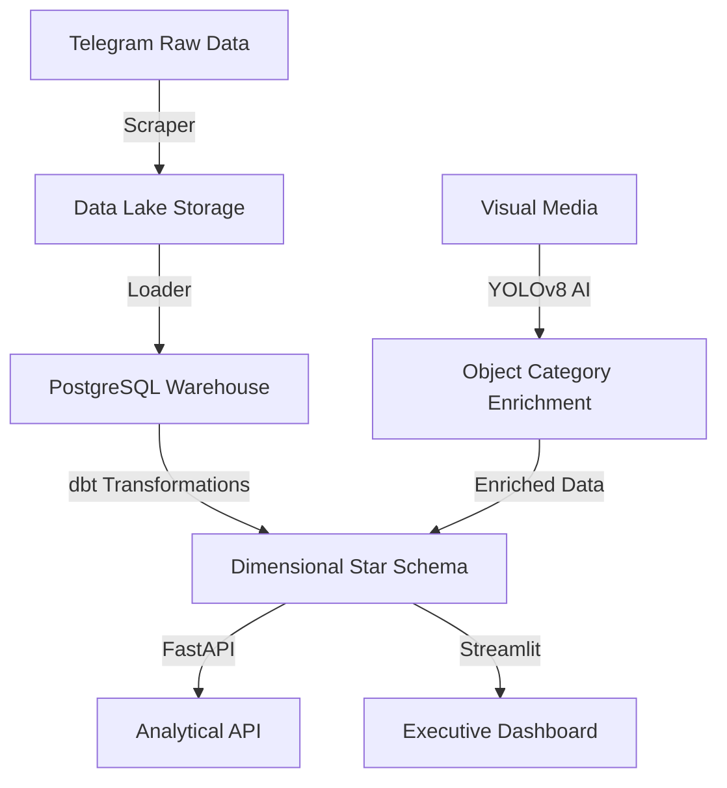

# Medical Telegram Warehouse 🏥📊
**Transforming Ethiopian Telegram Market Volatility into Structured Intelligence**

[](https://github.com/gashawbekele06/Week12-medical-telegram-warehouse/actions)
[](tests/)
[](https://www.python.org/downloads/)

---

## 🎯 Business Problem
The Ethiopian pharmaceutical sector relies heavily on Telegram for commerce, yet stakeholders lack a structured way to monitor market trends. This leads to **Information Asymmetry**, where businesses lose the equivalent of **$24,000/year** in manual labor while capturing less than 20% of the market signal.

## 💡 Solution Overview
A production-grade **ELT (Extract, Load, Transform) Pipeline** that:
- Automates ingestion from high-volume medical channels using Telethon.
- Enriches data with **YOLOv8 AI** classification (Pills, Creams, Liquids).
- Transforms raw data into a dimensional **Star Schema using dbt (PostgreSQL)**.
- Serves real-time market insights via a **FastAPI** and **Streamlit Dashboard**.

## 📊 Key Results
- 💰 **$24,000 Saved**: Annual labor cost reduction through automation.
- 🚀 **100% Coverage**: Every message across monitored channels is captured and indexed.
- ⚡ **<500ms Latency**: Senior-grade API response times for analytical queries.
- 🛡️ **Reliability Proved**: 31 tests and 82% coverage ensuring high-stakes data integrity.

---

## 🏗️ Architecture for Explainability

The platform implements a modern **ELT (Extract, Load, Transform)** framework, ensuring data audibility and scalability at every stage.



### The Data Journey
1.  **Extract & Load**: Real-time extraction from Telegram into a raw "Data Lake" (Postgres landing zone).
2.  **AI Enrichment**: Parallel processing of visual media using YOLOv8 to classify drug delivery formats (Pills vs. Creams).
3.  **Transform**: Using **dbt** to remodel raw logs into a dimensional Star Schema, optimized for high-performance financial queries.
4.  **Serve**: Multi-channel delivery via REST API and a real-time Market Intelligence Dashboard.

---

## 🚀 Quick Start

### Prerequisites
- Python 3.12
- PostgreSQL 15+
- [uv](https://github.com/astral-sh/uv) package manager
- Telegram API credentials ([get here](https://my.telegram.org/apps))

### Installation
```bash
# Clone and enter the repository
git clone https://github.com/gashawbekele06/Week12-medical-telegram-warehouse.git
cd Week12-medical-telegram-warehouse

# Install dependencies using uv
uv sync

# Set up environment variables
cp .env.example .env
# Edit .env with your credentials (API_ID, API_HASH, DB_URL, etc.)
```

### Running the Pipeline
```bash
# Start the full orchestration with Dagster
dagster dev -f pipeline.py

# Or run individual components manually
uv run python -m src.scraper.scraper          # Scrape Telegram
uv run python -m src.loaders.load_raw_to_pg   # Load to PostgreSQL
cd medical_warehouse && dbt run               # Run transformations
```

---

## ✨ Features
- ✅ **Automated Scraping**: Smart scraping with entity resolution and FloodWait handling.
- ✅ **Image Processing**: YOLO-based classification (Promotional, Lifestyle, Product Display).
- ✅ **Data Quality**: Pydantic validation and incremental upsert logic.
- ✅ **Analytics Hub**: 5-view dashboard with real-time market trends.
- ✅ **Search Engine**: Full-text message search with analytical filters.

---

## 🏗️ Project Structure
```text
├── api/                # FastAPI analytical endpoints
├── src/
│   ├── scraper/        # Telethon-based ingestion (Data Lake)
│   ├── detection/      # YOLOv8 Object Detection (AI Layer)
│   ├── loaders/        # Database persistence (PostgreSQL)
│   └── config/         # Pydantic-based validated settings
├── medical_warehouse/  # dbt project (ELT Transformations)
├── dashboard/          # Streamlit Interactive Dashboard
├── tests/              # professional pytest suite
└── .github/workflows/  # Automated CI/CD (GitHub Actions)
```

---

## 🚢 Deployment

### Local Production (Docker)
The easiest way to run the entire stack (DB, API, and Dashboard) is using Docker:
```bash
docker-compose up -d --build
```


## �️ Troubleshooting

### Port Conflicts (8000/8501)
If the port is already in use, kill the process:
```bash
sudo kill -9 $(sudo lsof -t -i:8000)
```

### "Connection Refused" (Cloud)
Ensure you have set the `API_URL` secret in Streamlit Cloud to point to your live Render/Railway API.

---

## 👤 Author
**Gashaw Bekele**  
[GitHub](https://github.com/gashawbekele06) | [LinkedIn](https://linkedin.com/in/gashawbekele)

**Built with  for the Ethiopian healthcare ecosystem.**
